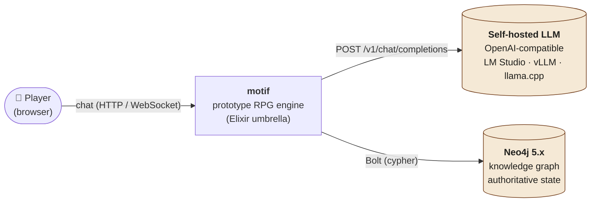
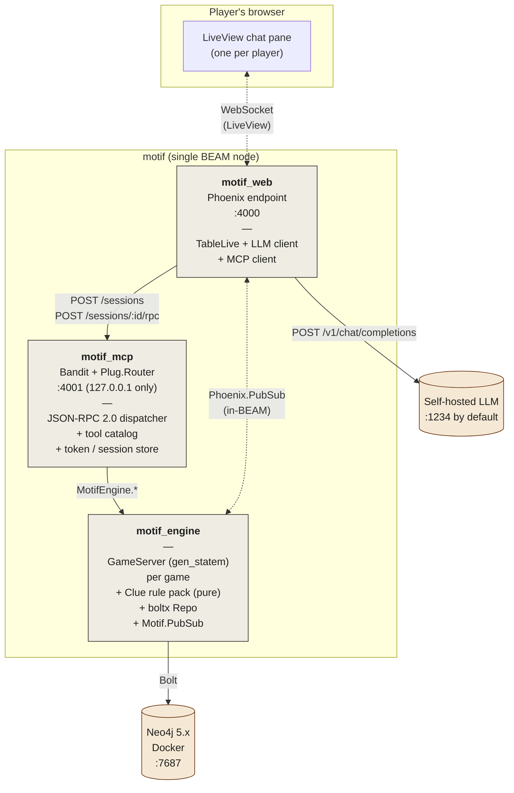
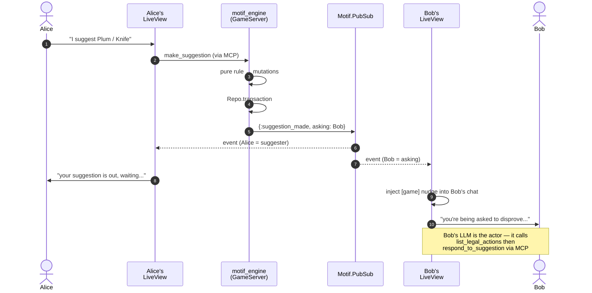

# Motif

A prototype for a multiplayer, AI-driven tabletop RPG engine. Players talk to a self-hosted LLM; the LLM acts on the engine via MCP; a Neo4j knowledge graph is the authoritative game state; rules are pure Elixir functions packaged per-game. The first concrete game is **Clue** (Cluedo); the long-term aim is "swap a rules package, get a new RPG."

This is research code. The architecture decisions it tests are written down in [`doc/adr/`](doc/adr/); the active plan is in [`doc/plan/`](doc/plan/); the playbook for AI agents working on the repo is in [`CLAUDE.md`](CLAUDE.md).

---

## What it tests

Four assumptions, codified in [ADR-0001](doc/adr/ADR-0001-architectural-boundaries.md):

1. **Players interact with the engine only via an LLM (chat).**
2. **The LLM interacts with the engine only via MCP** (Model Context Protocol).
3. **The Neo4j knowledge graph is mutated only by the rule engine** — never directly by MCP handlers or web code.
4. **Rules are deterministic, pure, and packaged per-game.**

All four hold under test; see the three invariant tests in [Tests](#tests) below.

---

## Architecture

### System context



The player never speaks directly to the LLM and never speaks directly to Neo4j. Both are mediated. The LLM is **self-hosted** — there is no SaaS-inference dependency ([ADR-0014](doc/adr/ADR-0014-self-hosted-llm-only.md)).

### Containers (C4 level 2)



**Key boundary integrity rules:**

- `motif_web` calls `motif_mcp` over **HTTP** (not in-process), even though they share a BEAM node. Concrete wire ([ADR-0008](doc/adr/ADR-0008-mcp-transport-local-sse.md), [ADR-0013](doc/adr/ADR-0013-homegrown-mcp-http-adapter.md)).
- `motif_mcp` calls `MotifEngine.*` directly (in-process Elixir).
- **`player_id` is stamped onto each MCP session at handshake** and read from session context only — never from tool arguments ([ADR-0009](doc/adr/ADR-0009-player-id-bound-at-mcp-session.md)). An AST static check enforces this on every tool module.
- `motif_engine` is the only writer to Neo4j. A telemetry-based runtime check pins this.

### Suggestion / disprove sub-turn (the architecturally informative bit)

When a player makes a suggestion in Clue, every other player must be asked to disprove in turn order. The server needs to "ask" a specific player's session without violating "LLM only via MCP." How:



The engine **never pushes** anything across the MCP wire. PubSub is internal to the BEAM (engine ↔ LiveView), not engine ↔ LLM. Every LLM action is still initiated by its LiveView (the MCP client), so ADR-0001 assumption 2 holds.

---

## Tech stack

| Layer | Choice | ADR |
|---|---|---|
| Language / runtime | Elixir 1.17 on OTP 27 (BEAM) | [0002](doc/adr/ADR-0002-elixir-otp-platform.md) |
| Web tier | Phoenix LiveView; OpenAI-compatible LLM via `req` | [0012](doc/adr/ADR-0012-phoenix-liveview-chat-surface.md), [0014](doc/adr/ADR-0014-self-hosted-llm-only.md) |
| MCP | Homegrown JSON-RPC 2.0 over HTTP (Bandit + Plug.Router) | [0005](doc/adr/ADR-0005-ex-mcp-library.md), [0013](doc/adr/ADR-0013-homegrown-mcp-http-adapter.md) |
| Rule engine | Pure rule functions + per-game `gen_statem` write coordinator; rules implement a behaviour | [0006](doc/adr/ADR-0006-rule-engine-pure-rules-and-write-coordinator.md), [0007](doc/adr/ADR-0007-rules-packaged-per-game-via-behaviour.md) |
| Storage | Neo4j 5.x via Docker, accessed through `boltx` | [0003](doc/adr/ADR-0003-neo4j-as-knowledge-graph.md), [0004](doc/adr/ADR-0004-boltx-neo4j-driver.md) |
| Project layout | Mix umbrella, 3 apps | [0011](doc/adr/ADR-0011-umbrella-project-layout.md) |
| Identity & trust | `player_id` bound at MCP session handshake | [0009](doc/adr/ADR-0009-player-id-bound-at-mcp-session.md) |
| Authoritative truth | Graph is canonical; no event log, no cache | [0010](doc/adr/ADR-0010-graph-is-authoritative.md) |

---

## Quickstart

### Prerequisites

- **Elixir 1.17 + OTP 27.** Pick one:
  - **Nix** (recommended for reproducibility): `nix develop` drops you into a shell with the right Elixir/Erlang. See [Nix flake](#nix-flake) below.
  - **asdf**: `.tool-versions` is committed; `asdf install` will read it.
  - **Native install**: Elixir 1.17 against OTP 27, however your platform packages them.
- **Docker** (for Neo4j; bundled Compose v2+).
- **A self-hosted LLM server** speaking the OpenAI Chat Completions spec.
  Dev default: [LM Studio](https://lmstudio.ai/) at `http://127.0.0.1:1234/v1`.
  Other options: [vLLM](https://docs.vllm.ai/), [llama.cpp's server](https://github.com/ggerganov/llama.cpp/tree/master/examples/server), Ollama (with `/v1` prefix).
  **Model must be tool-call capable** — Qwen 2.5 32B Instruct or larger is recommended. Smaller models will hallucinate hand contents and skip tool calls.

### 1. Clone + install deps

```bash
git clone <this-repo> motif
cd motif
mix deps.get
```

### 2. Start Neo4j

```bash
docker compose up -d --wait
```

The first run pulls the `neo4j:5-community` image (~150 MB) and starts it on `bolt://localhost:7687` and `http://localhost:7474`. Dev creds are `neo4j` / `motifdev` — see [`docker-compose.yml`](docker-compose.yml).

To browse the graph: open <http://localhost:7474> and log in with those creds.

### 3. Run the test suite

```bash
mix test
```

Expect **135 tests, 0 failures** (54 engine + 59 mcp + 22 web). Some are tagged `:integration` and require Neo4j to be running.

### 4. Try the engine on the CLI (no LLM needed)

```bash
# Create a Clue game with 3 players.
mix motif.new_game alice bob carol

# Watch two scripted moves alternately — milestone-3 demo.
mix motif.demo_moves

# Full HTTP+JSON-RPC MCP turn over the wire, including the
# ADR-0009 forged-arg negative test — milestone-4 demo.
mix motif.demo_mcp_turn

# Run a deterministic 6-player game to completion — milestone-7 demo.
mix motif.demo_six_player
```

Each demo prints a Cypher query you can paste into Neo4j Browser to inspect the final graph.

### 5. Play the chat-driven demo (needs the self-hosted LLM)

Start your LLM server first (e.g. open LM Studio, load `Qwen2.5-32B-Instruct` or similar, start the local server). Then:

```bash
# Override these env vars if your server / model differs from the
# LM Studio default.
export LLM_BASE_URL=http://127.0.0.1:1234/v1
export LLM_MODEL=qwen2.5-32b-instruct          # whatever your loaded model is called

iex -S mix
```

In the iex prompt:

```elixir
Mix.Task.run("motif.demo_chat")
```

It will print two URLs (one per player). Open each in its own browser tab; each tab is one player talking to Claude-shaped chat backed by your local model. Try things like *"what's in my hand?"*, *"move to the study"*, *"suggest plum with the rope"*. The other tab's LLM gets nudged automatically when it's their turn to disprove.

Leave the iex session running for the duration of play.

---

### Nix flake

A [`flake.nix`](flake.nix) is provided for reproducible BEAM toolchain provisioning. **It covers only Elixir + Erlang** — Docker and the LLM server are external concerns and intentionally outside the flake.

```bash
nix develop          # drops into a shell with Elixir 1.17 + OTP 27 on PATH
```

The shell hook puts Mix's metadata in `.nix-mix/` and `.nix-hex/` inside the project (both gitignored) so the global `~/.mix` is never touched.

For automatic shell activation when you `cd` into the project, add a `.envrc` and use [direnv](https://direnv.net):

```bash
echo "use flake" > .envrc
direnv allow
```

To format the flake itself: `nix fmt`.

---

## Tests

The headline tests verify the four architectural assumptions:

| Test | What it pins | File |
|---|---|---|
| **No `player_id` in tool args** (AST static check) | ADR-0009: tool handlers never read `player_id` from `args` | `apps/motif_mcp/test/motif_mcp/invariant_no_player_id_in_args_test.exs` |
| **Every transaction preceded by a rule call** (telemetry trace) | ADR-0010 + ADR-0006: rule engine is the only writer | `apps/motif_engine/test/motif_engine/invariant_mutation_trace_test.exs` |
| **Determinism replay** | ADR-0006: same `(seed, intents)` → identical graph state | `apps/motif_engine/test/motif_engine/invariant_determinism_test.exs` |
| **Hidden info: forged `player_id` arg is inert** (HTTP-level) | ADR-0009 over the wire | `apps/motif_mcp/test/motif_mcp/http_integration_test.exs` |
| **6-player game runs to a winner** | Full Clue rule machinery at max player count | `apps/motif_engine/test/motif_engine/six_player_game_test.exs` |

Run them individually with `mix test path/to/file.exs`.

---

## Project layout

```
motif/
├── apps/
│   ├── motif_engine/                  # rule behaviour, gen_statem, Clue rules, boltx repo
│   │   └── lib/motif_engine/
│   │       ├── rules.ex               # the behaviour every game implements
│   │       ├── rules/clue.ex          # the first concrete rules pack
│   │       ├── game_server.ex         # per-game gen_statem write coordinator
│   │       ├── snapshot.ex            # graph → in-memory read view
│   │       ├── repo.ex                # the sole sanctioned writer
│   │       └── events.ex              # Motif.PubSub helpers
│   ├── motif_mcp/                     # HTTP+JSON-RPC server, tool catalog, session auth
│   │   └── lib/motif_mcp/
│   │       ├── router.ex              # Plug.Router (Bandit)
│   │       ├── json_rpc.ex            # dispatch + humanized errors
│   │       ├── tools.ex               # tool registry
│   │       ├── tools/*.ex             # one file per tool
│   │       ├── auth.ex                # token store
│   │       └── session_manager.ex     # session → identity binding
│   └── motif_web/                     # Phoenix LiveView + LLM client + MCP client
│       └── lib/motif_web/
│           ├── live/table_live.ex     # per-player chat + tool-use loop
│           ├── llm.ex                 # OpenAI-compatible LLM client
│           └── mcp_client.ex          # talks to motif_mcp over HTTP
├── config/                            # umbrella-wide config + runtime env wiring
├── doc/
│   ├── adr/                           # Architecture Decision Records (load-bearing)
│   └── plan/                          # active plans
├── docker-compose.yml                 # Neo4j 5.x for local dev
└── CLAUDE.md                          # AI-agent playbook for this repo
```

---

## Where to read next

- **[`CLAUDE.md`](CLAUDE.md)** — orientation for AI agents working on the repo, plus the ADR authoring policy.
- **[`doc/adr/README.md`](doc/adr/README.md)** — index of all ADRs.
- **[`doc/adr/ADR-0001-architectural-boundaries.md`](doc/adr/ADR-0001-architectural-boundaries.md)** — the four assumptions, in plain English.
- **[`doc/adr/ADR-0013-homegrown-mcp-http-adapter.md`](doc/adr/ADR-0013-homegrown-mcp-http-adapter.md)** — why we wrote our own MCP server instead of using `ex_mcp`. The most interesting ADR if you're curious about the gap between MCP-the-spec and current Elixir tooling.
- **[`doc/plan/primary-goal-prototype-and-hazy-sparrow.md`](doc/plan/primary-goal-prototype-and-hazy-sparrow.md)** — the original plan and the build sequence.

---

## Status

Prototype-stage. The architecture under test holds; the engine and MCP boundary are robust. Open ends, in roughly descending order of "this would be the next thing to do":

- Replace the homegrown MCP adapter with `ex_mcp` once it exposes a session-context hook (see ADR-0013). Tool catalog stays as-is.
- Add SSE / WebSocket transport to the MCP server for proper server-initiated cues (currently a PubSub-based hack on the LiveView side).
- Lobby UI so players don't have to share URLs via the demo task.
- A second game's rules pack to validate the per-game packaging claim.
